# Diagrama de Classes — greencode

O diagrama abaixo está em sintaxe [Mermaid](https://mermaid.js.org/), renderizada
automaticamente pelo GitHub/GitLab e por qualquer visualizador Markdown compatível.
Para uma imagem estática, cole o bloco em https://mermaid.live/.

```mermaid
classDiagram
    %% ==================== DOMINIO: EQUIPAMENTO (heranca, abstracao, polimorfismo) ====================
    class EquipamentoBase {
        <<abstract>>
        #dto: EquipamentoDTO
        +id: string
        +tipo: TipoEquipamento
        +estadoFisico: EstadoFisico
        +status: StatusEquipamento
        +toDTO() EquipamentoDTO
        +descreverComponentesRecuperaveis()* string[]
        +calcularPotencialRecuperacao()* number
    }

    class TerminalComputador {
        +descreverComponentesRecuperaveis() string[]
        +calcularPotencialRecuperacao() number
    }

    class Periferico {
        +descreverComponentesRecuperaveis() string[]
        +calcularPotencialRecuperacao() number
    }

    class EquipamentoTelecom {
        +descreverComponentesRecuperaveis() string[]
        +calcularPotencialRecuperacao() number
    }

    EquipamentoBase <|-- TerminalComputador
    EquipamentoBase <|-- Periferico
    EquipamentoBase <|-- EquipamentoTelecom

    class EquipamentoFactory {
        <<factory>>
        +criarAPartirDeDTO(dto: EquipamentoDTO)$ EquipamentoBase
        +criarNovo(params)$ EquipamentoBase
    }
    EquipamentoFactory ..> EquipamentoBase : cria

    %% ==================== VALIDADORES (classe abstrata + estrategias) ====================
    class Validador~T~ {
        <<abstract>>
        #erros: string[]
        +validar(item: T) ResultadoValidacao
        #executar(item: T)*
        #adicionarErro(msg: string)
    }

    class ValidadorOrganizacao {
        #executar(item)
    }
    class ValidadorLote {
        #executar(item)
    }
    class ValidadorTransicaoStatus {
        #executar(item)
    }
    class ValidadorMudancaEstadoFisico {
        #executar(item)
    }

    Validador <|-- ValidadorOrganizacao
    Validador <|-- ValidadorLote
    Validador <|-- ValidadorTransicaoStatus
    Validador <|-- ValidadorMudancaEstadoFisico

    %% ==================== PERSISTENCIA ====================
    class CryptoService {
        -chaveMestra: Buffer
        +criptografar(texto: string) string
        +descriptografar(payload: string) string
        +gerarChaveMestra()$ string
        +hashSenha(senha: string)$ string
        +verificarSenha(senha, hash)$ boolean
        +checksum(conteudo: string)$ string
    }

    class SecureStore~T~ {
        -caminhoArquivo: string
        +ler() T[]
        +escrever(colecao: T[])
        +adicionar(item: T)
        +atualizar(predicado, atualizador) number
    }
    SecureStore --> CryptoService : usa

    class JournalManager {
        -arquivoAtivo: string
        +registrar(usuarioId, operacao, entidade, dados)
        +lerRegistrosAtivos() RegistroJournal[]
        +aplicarPoliticaRetencao() number
        -rotacionarSeNecessario()
    }
    JournalManager --> CryptoService : usa

    %% ==================== SERVICOS DE DOMINIO ====================
    class AuthService {
        +precisaProvisionar() boolean
        +provisionarInicial(senhaAdmin, username) CryptoService
        +carregarCryptoService() CryptoService
        +login(crypto, username, senha) Usuario
    }

    class SessionManager {
        -sessaoAtual: Sessao
        +iniciar(usuario: Usuario)
        +encerrar()
        +estaAutenticado() boolean
        +estaExpirada() boolean
        +registrarAtividade()
        +usuarioAtual() Usuario
    }

    class OrganizacaoService {
        +cadastrar(usuarioId, dados) ResultadoOperacao
        +listar() Organizacao[]
        +buscarPorId(cnpj) Organizacao
    }
    OrganizacaoService --> ValidadorOrganizacao : usa
    OrganizacaoService --> SecureStore : usa
    OrganizacaoService --> JournalManager : usa

    class LoteService {
        +criar(usuarioId, dados) ResultadoOperacao
        +listar() Lote[]
        +buscarPorId(id) Lote
        +atualizarStatus(usuarioId, id, status) ResultadoOperacao
    }
    LoteService --> ValidadorLote : usa
    LoteService --> SecureStore : usa
    LoteService --> JournalManager : usa

    class EquipamentoService {
        +cadastrarNoLote(usuarioId, dados) ResultadoOperacao
        +listarPorLote(loteId) EquipamentoDTO[]
        +triar(usuarioId, id, estado, justificativa) ResultadoOperacao
        +moverStatus(usuarioId, id, status, obs) ResultadoOperacao
        +rastrear(id) objeto
    }
    EquipamentoService --> EquipamentoFactory : usa
    EquipamentoService --> ValidadorTransicaoStatus : usa
    EquipamentoService --> ValidadorMudancaEstadoFisico : usa
    EquipamentoService --> SecureStore : usa
    EquipamentoService --> JournalManager : usa

    class AuditoriaService {
        +historicoCompleto() RegistroJournal[]
        +historicoPorUsuario(id) RegistroJournal[]
        +relatorioPotencialRecuperacao() LinhaRelatorio[]
        +linhaDoTempoEquipamento(id) Movimentacao[]
    }
    AuditoriaService --> JournalManager : usa
    AuditoriaService --> EquipamentoFactory : usa

    %% ==================== CLI ====================
    class ComandoRouter {
        +executar(comando: ComandoParseado) RespostaComando
        -rotearUsuario(comando, usuario)
        -rotearOrganizacao(comando, usuario)
        -rotearLote(comando, usuario)
        -rotearEquipamento(comando, usuario)
        -rotearAuditoria(comando)
        -rotearRelatorio(comando)
    }
    ComandoRouter --> SessionManager : usa
    ComandoRouter --> OrganizacaoService : usa
    ComandoRouter --> LoteService : usa
    ComandoRouter --> EquipamentoService : usa
    ComandoRouter --> AuditoriaService : usa

    %% ==================== MODELOS DE DADOS (entidades) ====================
    class Usuario {
        +id: string
        +username: string
        +hashSenha: string
        +papel: Papel
        +ativo: boolean
    }

    class Organizacao {
        +id: string
        +razaoSocial: string
        +segmento: string
        +contrato: Contrato
    }

    class Lote {
        +id: string
        +orgId: string
        +notaFiscal: string
        +transportadora: string
        +status: StatusLote
    }

    class Movimentacao {
        +id: string
        +equipamentoId: string
        +statusAnterior: StatusEquipamento
        +statusNovo: StatusEquipamento
        +usuarioId: string
    }

    class Papel {
        <<enumeration>>
        ADMINISTRADOR
        OPERADOR_CADASTRO
        GESTOR_ALMOXARIFADO
        AUDITOR
    }

    class EstadoFisico {
        <<enumeration>>
        NOVO
        BOM
        REGULAR
        RUIM
        INSERVIVEL
    }

    class StatusEquipamento {
        <<enumeration>>
        AGUARDANDO_TRIAGEM
        TRIADO
        DESMONTE
        RECICLAGEM
        DESCARTE_SEGURO
    }

    Usuario --> Papel
    EquipamentoBase --> EstadoFisico
    EquipamentoBase --> StatusEquipamento
    Lote "1" --> "0..*" EquipamentoBase : contem
    EquipamentoBase "1" --> "0..*" Movimentacao : gera
    Organizacao "1" --> "0..*" Lote : gera
```

## Padrões de projeto e conceitos de POO evidenciados

| Conceito | Onde aparece |
|---|---|
| **Classe abstrata** | `EquipamentoBase`, `Validador<T>` |
| **Herança** | `TerminalComputador`, `Periferico`, `EquipamentoTelecom` estendem `EquipamentoBase`; `ValidadorOrganizacao`, `ValidadorLote`, `ValidadorTransicaoStatus`, `ValidadorMudancaEstadoFisico` estendem `Validador<T>` |
| **Polimorfismo** | `calcularPotencialRecuperacao()` e `descreverComponentesRecuperaveis()` têm implementação própria em cada subclasse de `EquipamentoBase`; `AuditoriaService.relatorioPotencialRecuperacao()` chama esses métodos sem conhecer o subtipo concreto |
| **Fábrica (Factory Method)** | `EquipamentoFactory` decide qual subclasse instanciar a partir do `TipoEquipamento`, isolando essa decisão do restante do sistema |
| **Generics** | `Validador<T>`, `SecureStore<T>` — reutilizados para qualquer entidade do domínio |
| **Composição sobre herança nos serviços** | Cada `*Service` recebe `CryptoService`, `SecureStore` e `JournalManager` via injeção no construtor, em vez de herdar comportamento comum |
| **Extensibilidade citada na proposta** | Um novo tipo de ativo (bateria de veículo elétrico, painel solar) exige apenas uma nova subclasse de `EquipamentoBase` + um novo caso no `switch` da fábrica — o núcleo do sistema (services, CLI, validadores, journal) permanece inalterado |
